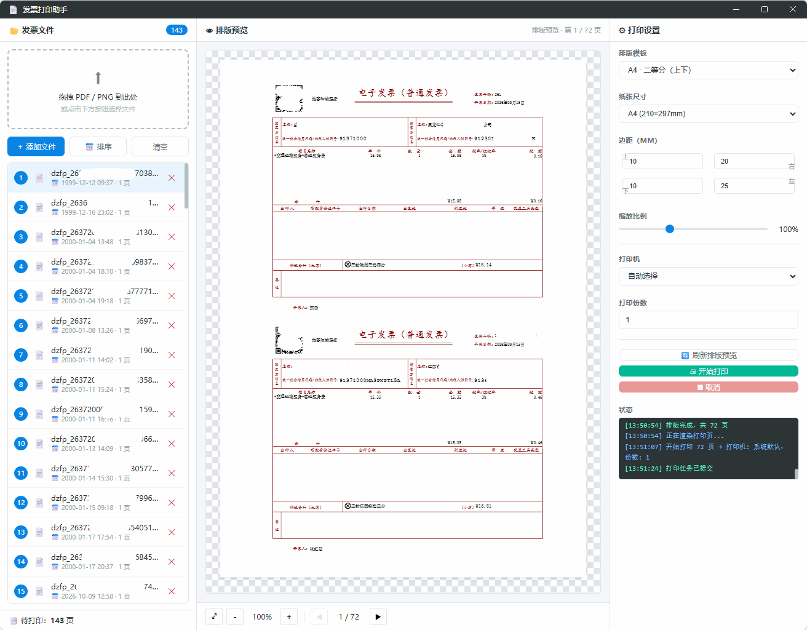

# 发票打印助手

一款专为企业财务、个体经营者设计的**发票合并打印工具**，支持 PDF / PNG 格式电子发票的批量导入与智能排版。绿色免安装，本地化处理保障数据安全，简化打印流程。



## 功能特性

- **全格式批量处理**：支持 PDF、PNG 主流发票格式批量导入，拖拽文件或一键添加即可快速导入
- **灵活排版与智能适配**：提供 A4 多联排版（二等分、三等分、四等分）、A5 纸打印模式，支持自定义边距、缩放比例，自动按比例缩放居中，避免手动调整
- **实时排版预览**：切换模板、边距、缩放时自动重排版，所见即所得
- **高效打印**：打印机枚举选择、多份打印，内置状态日志
- **设置记忆**：排版模板、边距、缩放、打印机等偏好自动持久化，重启恢复
- **零门槛 & 数据安全**：绿色免安装、解压即用；全程本地处理，无网络依赖

## 界面说明

三栏布局：

| 区域 | 功能 |
|---|---|
| 左栏 · 发票文件 | 拖拽/添加文件、文件列表（页数/尺寸）、排序删除、待打印页数统计 |
| 中栏 · 排版预览 | 实时渲染排版效果，支持缩放（±10%、适应窗口）、翻页 |
| 右栏 · 打印设置 | 排版模板、纸张、边距、缩放、打印机、份数、开始打印、状态日志 |

## 排版模板

| 模板 | 纸张 | 布局 | 每页发票数 |
|---|---|---|---|
| A4 · 单联 | A4 | 满页 | 1 |
| A4 · 二等分（上下） | A4 | 上下 1×2 | 2 |
| A4 · 二等分（左右） | A4 | 左右 2×1 | 2 |
| A4 · 三等分（上中下） | A4 | 上中下 1×3 | 3 |
| A4 · 四等分 | A4 | 2×2 | 4 |
| A5 · 单联 | A5 | 满页 | 1 |

发票按原始比例缩放后居中放入对应格子，超出格子自动等比缩小，永不错位。

## 快速开始

### 环境要求

- Node.js ≥ 18
- npm ≥ 8

### 开发运行

```bash
npm install        # 首次安装依赖（Electron 二进制下载较慢，见常见问题）
npm start
```

### 打包绿色版

```bash
npm run dist:portable
```

产物：`dist\发票打印助手-1.0.0-portable.exe`（单文件，拷贝到任意 Windows 机器双击即用，无需安装）。

## 使用步骤

1. **导入发票**：把 PDF / PNG 发票拖入左栏，或点击「＋ 添加文件」多选导入（按路径自动去重）
2. **调整顺序**：需要合并打印时按预期顺序排列文件（可在列表中删除多余文件）
3. **选择排版**：右栏选择模板（如 A4 二等分），中栏即时预览排版效果
4. **微调**：按需修改边距（mm）、缩放比例（50%–200%）
5. **选择打印机**：下拉选择目标打印机，设置打印份数
6. **打印**：点击「🖨 开始打印」，状态栏显示进度与结果

## 项目结构

```
fapiao/
├── package.json              # 依赖与 electron-builder 打包配置
├── main.js                   # Electron 主进程（窗口、IPC、打印机、执行打印）
├── preload.js                # contextBridge 安全桥接
├── layout-engine.cjs         # ⭐ 核心排版引擎（主进程 pdf-lib 合成 PDF）
└── renderer/
    ├── index.html            # 三栏主界面
    ├── css/style.css         # 界面样式
    └── js/
        ├── app.js            # 渲染进程入口（UI 编排 + 预览渲染）
        ├── file-manager.js   # 文件导入/去重/排序状态管理
        ├── print-manager.js  # 打印队列与状态日志
        └── settings.js       # 偏好持久化封装
```

## 技术栈

| 模块 | 技术 | 说明 |
|---|---|---|
| 桌面壳 | Electron | 跨平台、原生打印 API |
| PDF 合成 | pdf-lib | 主进程内完成多联页面嵌入与缩放 |
| PDF 预览 | pdfjs-dist | Canvas 渲染排版结果 |
| 偏好存储 | electron-store | 本地 JSON 持久化 |
| 打包 | electron-builder | Windows portable 绿色单文件 |

> 架构说明：排版在**主进程**完成（pdf-lib 以 CommonJS 加载，规避 ESM 扩展名问题）；渲染进程仅负责 UI 与 pdfjs 预览，两者通过 IPC 传递字节数组。

## 常见问题

**Q：安装依赖时 Electron 下载很慢？**

配置国内镜像后重装：

```powershell
$env:ELECTRON_MIRROR = "https://npmmirror.com/mirrors/electron/"
npm install
```

**Q：如何更换应用图标？**

准备 256×256 以上的 PNG 放到 `assets\icon.png`，在 `package.json` 的 `build.win` 中加入 `"icon": "assets/icon.png"` 后重新打包。

**Q：发票是扫描版 PNG，打印清晰度不够？**

建议使用高分辨率 PNG（≥ 150 DPI），或在源系统导出为 PDF 后导入。

**Q：打印没有输出？**

右栏确认打印机名称正确；部分打印机需在系统打印首选项中设置默认纸盒。状态日志会显示具体错误。

**Q：数据安全吗？**

所有解析、排版均在本地内存完成，不发起任何网络请求；打印临时文件用后即删。

## License

MIT
